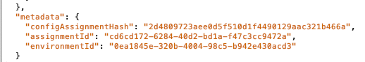
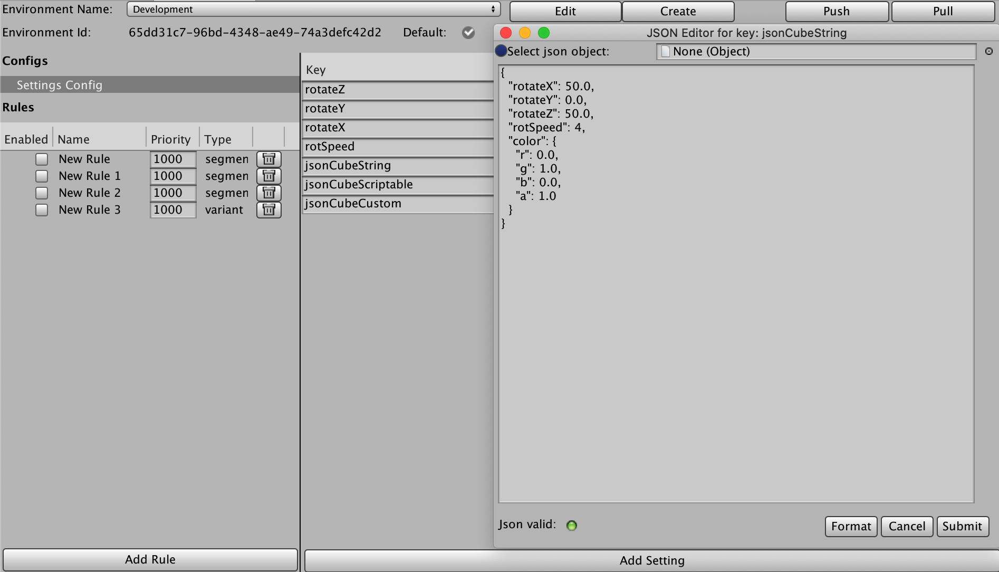
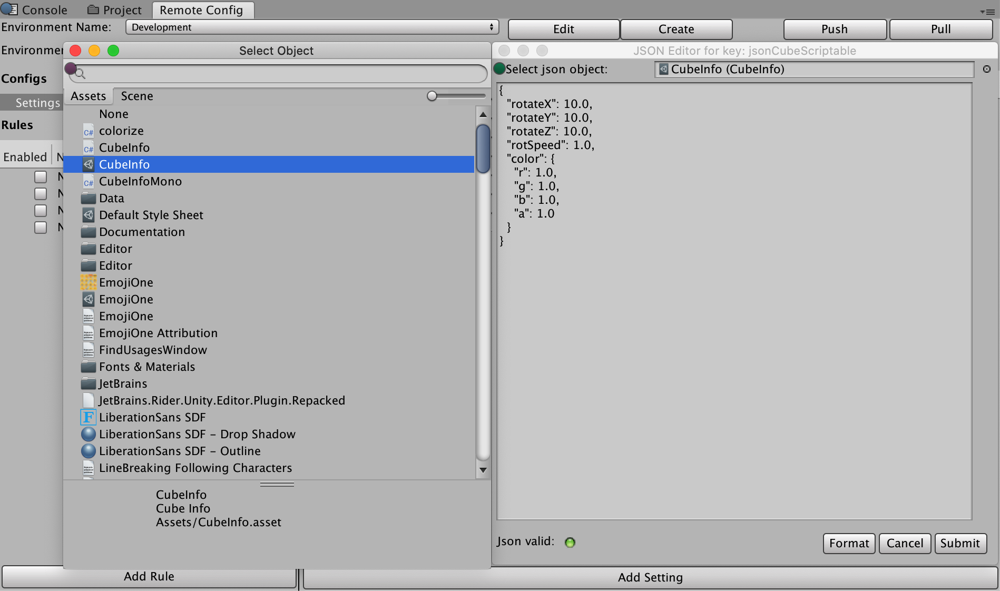
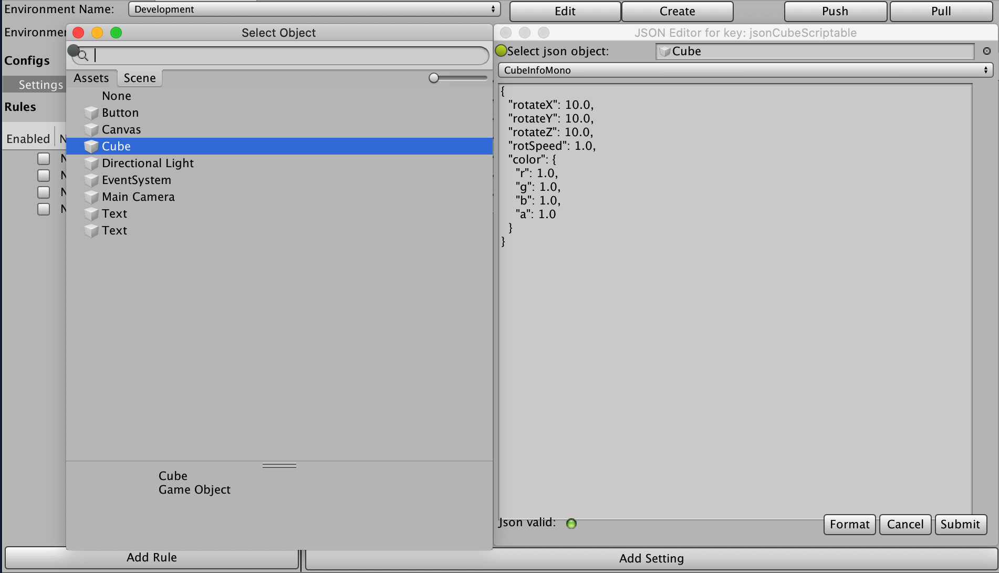

# Code integration
The `RemoteConfig` API is included in the `Unity.Services` namespace, which you must include in your game script. For more information on its classes and methods, see the [Remote Config Scripting API](../api/index.html) and the [Remote Config Runtime Scripting API](https://docs.unity3d.com/Packages/com.unity.remote-config-runtime@3.1/api/index.html) documentation.

## Implementing custom attributes
To provide custom attributes for [Game Overrides conditions](GameOverridesAndSettings.md#condition), implement the following `struct` variables in your game script:

* Use the `Delivery` structure to provide a custom player ID attribute by using the `SetCustomUserID` method if your application uses its own tracking method. Remote Config will auto-generate an ID if no developer-defined attribute is available.
* Use the `userAttributes` structure to provide custom **user**-category attributes.
* Use the `appAttributes` structure to provide custom **app**-category attributes.
* Use the `filterAttributes` structure to provide custom **filter**-category attributes in order to reduce the payload.

**Note**: Custom attributes are entirely optional. You can implement Unity Remote Config without these structs and use the predefined Unity attributes for Game Overrides conditions. For more information on attribute categories, see documentation on [conditions](GameOverridesAndSettings.md#condition).

Start by creating a framework for your script that implements your custom attributes and blocks out your functions:

```c#
using UnityEngine;
using Unity.Services.RemoteConfig;
using Unity.Services.Authentication;
using Unity.Services.Core;
using System.Threading.Tasks;

public class RemoteConfigExample : MonoBehaviour {

    public struct userAttributes {
      // Optionally declare variables for any custom user attributes:
        public bool expansionFlag;
    }

    public struct appAttributes {
      // Optionally declare variables for any custom app attributes:
        public int level;
        public int score;
        public string appVersion;
    }

    public struct filterAttributes {
      // Optionally declare variables for attributes to filter on any of following parameters:
        public string[] key;
        public string[] type;
        public string[] schemaId;
    }

    // Optionally declare a unique assignmentId if you need it for tracking:
    public string assignmentId;

    // Declare any Settings variables you’ll want to configure remotely:
    public int enemyVolume;
    public float enemyHealth;
    public float enemyDamage;


    // The Remote Config package depends on Unity's authentication and core services.
    // These dependencies require a small amount of user code for proper configuration.
    async Task InitializeRemoteConfigAsync()
    {
            // initialize handlers for unity game services
            await UnityServices.InitializeAsync();

            // options can be passed in the initializer, e.g if you want to set AnalyticsUserId or an EnvironmentName use the lines from below:
            // var options = new InitializationOptions()
            // .SetEnvironmentName("testing")
            // .SetAnalyticsUserId("test-user-id-12345");
            // await UnityServices.InitializeAsync(options);

            // remote config requires authentication for managing environment information
            if (!AuthenticationService.Instance.IsSignedIn)
            {
                await AuthenticationService.Instance.SignInAnonymouslyAsync();
            }
    }

    async Task Awake () {
        // In this example, you will fetch configuration settings on Awake.
    }

    // Create a function to set your variables to their keyed values:
    void ApplyRemoteConfig (ConfigResponse configResponse) {
        // You will implement this in the final step.
    }
}
```

## Fetching and applying settings at runtime
Next, implement your Remote Config support functions and call them at runtime to retrieve key-value pairs from the service then map them to the appropriate variables.

The Remote Config service returns a [`RemoteConfigService.Instance`](https://docs.unity3d.com/Packages/com.unity.remote-config-runtime@3.1/api/Unity.Service.RemoteConfig.RemoteConfigService.html) object to handle fetching and applying your configuration settings at runtime. In this example, you’ll use it to fetch the key-value pairs from the remote service, and invoke your `ApplyRemoteConfig` function on retrieval. `ApplyRemoteConfig` takes a [`ConfigResponse`](https://docs.unity3d.com/Packages/com.unity.remote-config-runtime@3.1/api/Unity.Service.RemoteConfig.ConfigResponse.html) struct, which represents the response to a fetch request, and uses the [`RemoteConfigService.Instance.appConfig`](../api/Unity.Service.RemoteConfig.RemoteConfigService.appConfig.html) method to apply settings.

```c#
    // Retrieve and apply the current key-value pairs from the service on Awake:
    async Task Awake () {

        // initialize Unity's authentication and core services, however check for internet connection
        // in order to fail gracefully without throwing exception if connection does not exist
        if (Utilities.CheckForInternetConnection()) 
        {
            await InitializeRemoteConfigAsync();
        }

        // Add a listener to apply settings when successfully retrieved:
        RemoteConfigService.Instance.FetchCompleted += ApplyRemoteConfig;

        // you can set the user’s unique ID:
        // RemoteConfigService.Instance.SetCustomUserID("some-user-id");

        // you can set the environment ID:
        // RemoteConfigService.Instance.SetEnvironmentID("an-env-id");

        // Fetch configuration settings from the remote service, they must be called with the attributes structs (empty or with custom attributes) to initiate the WebRequest.
        await RemoteConfigService.Instance.FetchConfigsAsync(new userAttributes(), new appAttributes());

        // Example on how to fetch configuration settings using filter attributes:
        // var fAttributes = new filterAttributes();
        // fAttributes.key = new string[] { "sword","cannon" };
        // RemoteConfigService.Instance.FetchConfigs(new userAttributes(), new appAttributes(), fAttributes);

        // Example on how to fetch configuration settings if you have dedicated configType:
        // var configType = "specialConfigType";
        // Fetch configs of that configType
        // RemoteConfigService.Instance.FetchConfigs(configType, new userAttributes(), new appAttributes());
        // Configuration can be fetched with both configType and fAttributes passed
        // RemoteConfigService.Instance.FetchConfigs(configType, new userAttributes(), new appAttributes(), fAttributes);

        // All examples from above will also work asynchronously, returning Task<RuntimeConfig>
        // await RemoteConfigService.Instance.FetchConfigsAsync(new userAttributes(), new appAttributes());
        // await RemoteConfigService.Instance.FetchConfigsAsync(new userAttributes(), new appAttributes(), fAttributes);
        // await RemoteConfigService.Instance.FetchConfigsAsync(configType, new userAttributes(), new appAttributes());
        // await RemoteConfigService.Instance.FetchConfigsAsync(configType, new userAttributes(), new appAttributes(), fAttributes);

    }

    void ApplyRemoteConfig (ConfigResponse configResponse) {
        // Conditionally update settings, depending on the response's origin:
        switch (configResponse.requestOrigin) {
            case ConfigOrigin.Default:
                Debug.Log ("No settings loaded this session and no local cache file exists; using default values.");
                break;
            case ConfigOrigin.Cached:
                Debug.Log ("No settings loaded this session; using cached values from a previous session.");
                break;
            case ConfigOrigin.Remote:
                Debug.Log ("New settings loaded this session; update values accordingly.");
                break;
        }

        enemyVolume = RemoteConfigService.Instance.appConfig.GetInt("enemyVolume");
        enemyHealth = RemoteConfigService.Instance.appConfig.GetInt("enemyHealth");
        enemyDamage = RemoteConfigService.Instance.appConfig.GetFloat("enemyDamage");
        assignmentId = RemoteConfigService.Instance.appConfig.assignmentId;

        // These calls could also be used with the 2nd optional arg to provide a default value, e.g:
        // enemyVolume = RemoteConfigService.Instance.appConfig.GetInt("enemyVolume", 100);
    }
```

## Accessing configs with particular config types

All settings for corresponding config types will be correctly stored in the cache, and they could be accessed by passing the config type, such as:
```c#
RemoteConfigService.Instance.GetConfig("settings");
RemoteConfigService.Instance.GetConfig("specialConfigType");
```

## Metadata Parameters

Upon every request, we create an assignment event on the backend.

Within response to that request, together with `configs` block, a `metadata` block is returned as a part of response with following parameters:



- `assignmentId` gets created on each assignment event and it is used to track events and eventual user segmentation
- `environmentId` represents environment in which assignment happened
- `configAssignmentHash` is created upon assignment and presents a unique signature of that particular assignment

`configAssignmentHash` can be accessed from `appConfig`: 
```c#
RemoteConfigService.Instance.appConfig.configAssignmentHash
```

Once we know the `configAssignmentHash` we want to use, it can be passed to the backend within the payload by using the `SetConfigAssignmentHash()` method:
```c#
RemoteConfigService.Instance.SetConfigAssignmentHash("4d1064c5198a26f073fe8301da3fc5ead35d20d1"); 
```

If `configAssignmentHash` is passed to the backend, the backend will return the config present at the time of creation of that particular `configAssignmentHash`.

TTL for the lifetime of `configAssignmentHash` is 56 hours. After that time, `configAssignmentHash` can be requested again, and TTL will reset to 56 hrs again.


## Other considerations
### Utilizing Setting of type JSON for overwriting objects

Let's say our code has a class `CubeInfo` as follows:
```c#
[System.Serializable]
public class CubeInfo
{
    public float rotateX = 10f;
    public float rotateY = 10f;
    public float rotateZ = 10f;
    public float rotSpeed = 1.0f;
    public Color color = Color.white;
}

```
The JSON editor modal supports JSON conversion of following types:
- Text Assets
- Scriptable Objects
- Custom Scripts attached to Game Objects

If we want to use a Text Asset, we set up a Setting which structurally matches the `CubeInfo` class:


For Scriptable Objects, click on the upper right dot next to selection box, and if you pick a scriptable object, it should automatically convert to json:


If you select your Game Object from the scene, an additional dropdown will show for all Monobehavior Custom Scripts attached to that Game Object.
The one you select should be converted to JSON:


To apply those settings to the CubeInfo object in runtime, use [JsonUtility](https://docs.unity3d.com/ScriptReference/JsonUtility.html) class for that matter:
```c#
case ConfigOrigin.Remote:
    var jsonCubeString = RemoteConfigService.Instance.appConfig.GetJson("jsonCubeString");
    JsonUtility.FromJsonOverwrite(jsonCubeString, CubeInfo);
```

### Security
The web service from which Unity downloads Remote Config data is read-only, but not secure. This means third parties could view your Remote Config data. Do not store sensitive or secret information in your configuration settings. Similarly, the saved settings file could be read and modified by end-users (although Remote Config would overwrite any modifications the next time a session starts with an available Internet connection).

### Platform Support
Current version of Remote Config Runtime is tested successfully for following platforms: 

Desktop:
- Windows (PC)
- Mac
- Linux Standalone
 
Mobile:
- iOS
- Android
 
Consoles:
- PS5
- PS4
- Xbox One
- Nintendo Switch