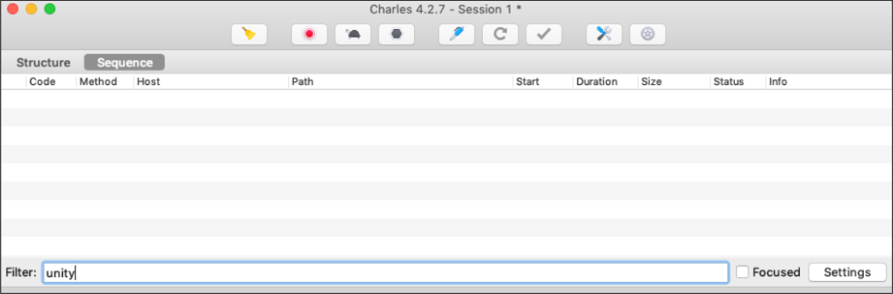
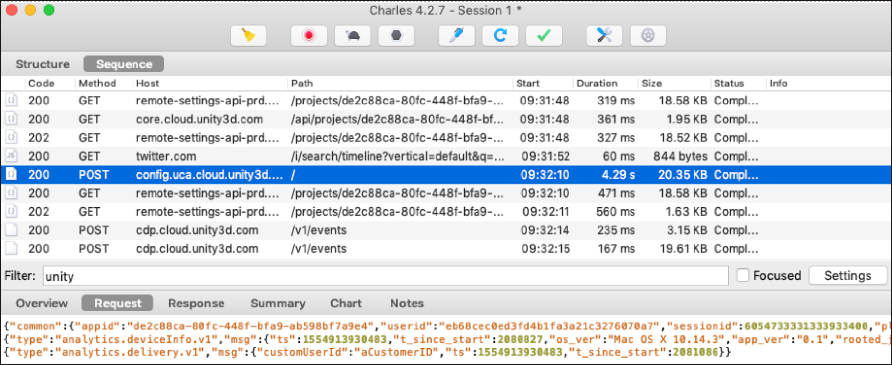

# Code integration
The `RemoteConfig` API is included in the `Unity` namespace. You must include this in your game script. For more information on its classes and methods, see the [Scripting API](../api/index.html) documentation.

## Initialization
The Remote Config package depends on Unity's authentication and core services.
These dependencies require a small amount of user code for proper configuration.

```c#
using Unity.Services.Authentication;
using Unity.Services.Core;
using System.Threading.Tasks;

async Task InitializeRemoteConfigAsync()
{
        // initialize handlers for unity game services
        await UnityServices.InitializeAsync();

        // remote config requires authentication for managing environment information
        if (!AuthenticationService.Instance.IsSignedIn)
        {
            await AuthenticationService.Instance.SignInAnonymouslyAsync();
        }
}
```


## Implementing custom attributes
To provide custom attributes for [Rule conditions](RulesAndSettings.md#condition), implement the following `struct` variables in your game script:

* Use the `Delivery` structure to provide a custom player ID attribute by using the `SetCustomUserID` method if your application uses its own tracking method. Remote Config will auto-generate an ID if no developer-defined attribute is available.
* Use the `userAttributes` structure to provide custom **user**-category attributes.
* Use the `appAttributes` structure to provide custom **app**-category attributes.

**Note**: Custom attributes are entirely optional. You can implement Remote Config Runtime without these structs and use the predefined unity attributes for Rule conditions.

Start by creating a framework for your script that implements your custom attributes and blocks out your functions:

```c#
using UnityEngine;
using Unity.RemoteConfig;

public class RemoteConfigExample : MonoBehaviour {

    public struct userAttributes {
      // Optionally declare variables for any custom user attributes:
        public bool expansionFlag;
    }

    public struct appAttributes {
      // Optionally declare variables for any custom app attributes:
        public int level;
        public int score;
        public string appVersion;
    }

    public struct filterAttributes {
      // Optionally declare variables for any filter attributes:
        public string[] key;
        public string[] type;
        public string[] schemaId;
    }

    // Optionally declare a unique assignmentId if you need it for tracking:
    public string assignmentId;

    // Declare any Settings variables you’ll want to configure remotely:
    public int enemyVolume;
    public float enemyHealth;
    public float enemyDamage;    

    // ConfigManager.FetchConfigs must be called with the attributes structs (empty or with custom attributes) to initiate the WebRequest.

    void Awake () {
        // In this example, you will fetch configuration settings on Awake.
    }

    // Create a function to set your variables to their keyed values:
    void ApplyRemoteSettings (ConfigResponse configResponse) {
        // You will implement this in the final step.
    }
}
```

## Fetching and applying settings at runtime
Next, implement your Remote Config support functions, and call them at runtime to retrieve key-value pairs from the service then map them to the appropriate variables.

The Remote Config service returns a [`ConfigManager`](../api/Unity.RemoteConfig.ConfigManager.html) object to fetch and apply your configuration settings at runtime. In this example, you’ll use it to fetch the key-value pairs from the remote service, and invoke your `ApplyRemoteSettings` function when the retrieval succeeds. `ApplyRemoteSettings` takes a [`ConfigResponse`](../api/Unity.RemoteConfig.ConfigResponse.html) struct, which represents the response to a fetch request, and uses the [`ConfigManager.appConfig`](../api/Unity.RemoteConfig.ConfigManager.appConfig.html) method to apply settings.

```c#
    // Retrieve and apply the current key-value pairs from the service on Awake:
    void Awake () {
        // Add a listener to apply settings when successfully retrieved:
        ConfigManager.FetchCompleted += ApplyRemoteSettings;

        // Set the user’s unique ID:
        ConfigManager.SetCustomUserID("some-user-id");

        // Set the environment ID:
        ConfigManager.SetEnvironmentID("an-env-id");

        // Fetch configuration settings from the remote service:
        ConfigManager.FetchConfigs<userAttributes, appAttributes>(new userAttributes(), new appAttributes());

        // Fetch configuration settings could be also called with filterAttributes in order to get response filtered by key, type or schemaId:
        ConfigManager.FetchConfigs<userAttributes, appAttributes, filterAttributes>(new userAttributes(), new appAttributes(), new filterAttributes());
    }

    void ApplyRemoteSettings (ConfigResponse configResponse) {
        // Conditionally update settings, depending on the response's origin:
        switch (configResponse.requestOrigin) {
            case ConfigOrigin.Default:
                Debug.Log ("No settings loaded this session; using default values.");
                break;
            case ConfigOrigin.Cached:
                Debug.Log ("No settings loaded this session; using cached values from a previous session.");
                break;
            case ConfigOrigin.Remote:
                Debug.Log ("New settings loaded this session; update values accordingly.");
                enemyVolume = ConfigManager.appConfig.GetInt ("enemyVolume");
                enemyHealth = ConfigManager.appConfig.GetInt ("enemyHealth");
                enemyDamage = ConfigManager.appConfig.GetFloat ("enemyDamage");
                assignmentId = ConfigManager.appConfig.assignmentId;
                break;
        }
    }
```

## Other considerations
### Utilizing setting of type Json for overwriting objects

Let's say our code has a class `CubeInfo` as follows:
```c#
[System.Serializable]
public class CubeInfo
{
    public float rotateX = 10f;
    public float rotateY = 10f;
    public float rotateZ = 10f;
    public float rotSpeed = 1.0f;
    public Color color = Color.white;
}

```

### Custom ID verification
To check that you implemented a request with `customUserId` correctly, you can use a utility such as [Charles proxy](https://support.unity3d.com/hc/en-us/articles/115002917683-Using-Charles-Proxy-with-Unity) to check the contents of the actual network request messages. Using Charles, you can check your implementation of a Remote Config request with custom user IDs by following these steps:

1. Open the Charles proxy and clear all events. You can also add "unity" in the filter field.<br><br>
2. In the Unity Editor, select the **Play** button, then look in Charles for the POST request to `config.uca.cloud.unity3d.com/` . Your custom user ID should be in the request as a value inside the `"msg"` key for `"type": "analytics.delivery.v1"`.<br><br>

After the test, close Charles so it doesn't interfere with other web requests.

### Security
The web service from which Unity downloads Remote Config data is read-only, but not secure. This means third parties could view your Remote Config data. Do not store sensitive or secret information in your configuration settings. Similarly, the saved settings file could be read and modified by end-users (although Remote Config would overwrite any modifications the next time a session starts with an available Internet connection).
