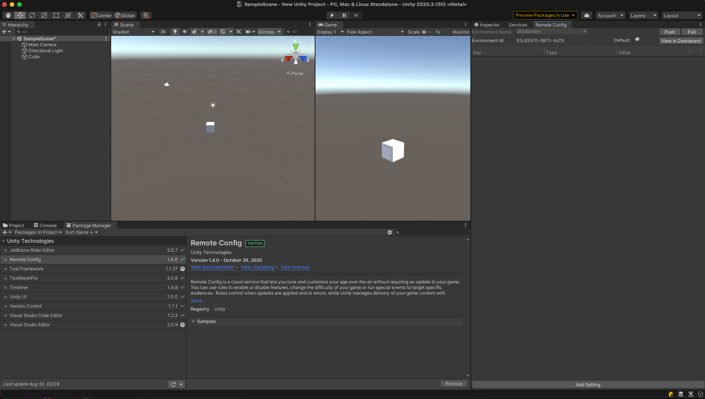
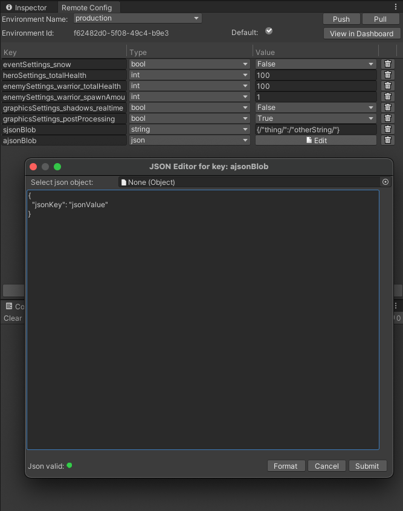
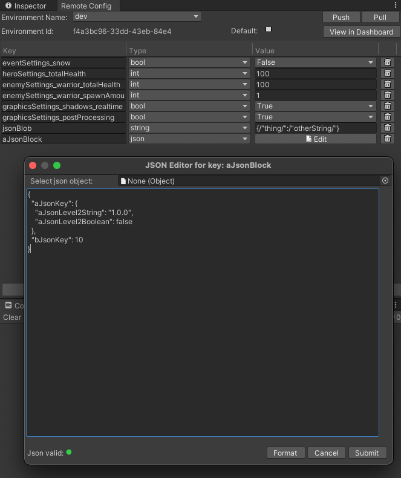
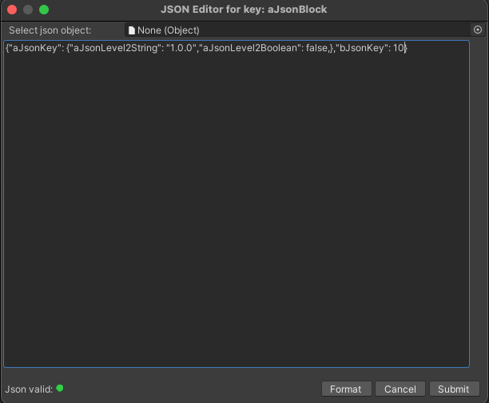
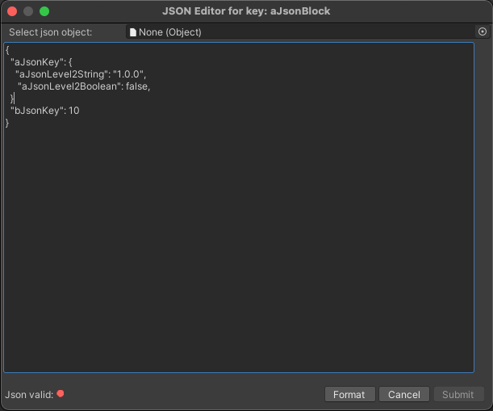

# Game Overrides and Settings

Unity Remote Config uses __Game Overrides__ (formerly named __Campaigns__) to target specific user groups and deliver different settings for each group. Game Overrides are linked to __Settings__, which you’ll map to variables in your game code to override their default values when the audience criteria for a Game Override is met.

Plan Remote Config settings early, when you design your game or before a new deployment. Unity recommends including inert Remote Config settings with your initial deployment, which you can later apply once you understand how your audience uses your game, and how it performs on different devices.

In the Unity Editor, select **Window** > **Remote Config** to open the **Remote Config** window to begin working with Settings.



Use the **Remote Config** window to configure your Remote Config Settings. Game Overrides can be configured in the Web Dashboard which can be accessed with the **Open Dashboard** button.  Game Overrides dictate conditions or player segments through which to surface Settings. By default, you start with one config **Settings Config**. This config contains the default Settings that all users receive unless an active Game Override with [higher priority](#prioritizing-GameOverrides) applies.

**Important**: Each [environment](ConfiguringYourProject.md#remote-config-environments) has a unique Game Overrides set. Before configuring Game Overrides for your game, make sure you select the correct Remote Config environment in the **Remote Config** window.

A Setting is a key/value pair. You will map the key name to a variable in your game code, so you can dynamically change its value without changing your code.

## Adding new Settings
The default **Settings Config** config contains every Setting you create for a given environment. To create a new Setting, highlight the **Settings Config** config, then click the **Add Setting** button at the bottom of the right panel.

**Note**: You must create Settings in the Editor, since that is where the game code can consume them. However, once you’ve created Settings in the game binary, you can also update them using the Remote Config [REST APIs](RESTAPI.md) or the Remote Config [Web Dashboard](WebDashboard.md).

Each Setting consists of a **Key**, **Type**, and **Value**:

| **Parameter** | **Description** | **Example** |
| ------------- | --------------- | ----------- |
| **Key** | The name of the Setting, which must adhere to the following Game Overrides:<br><br><ul><li>Must be unique within its environment.</li><li>Must start with a letter.</li><li>May only contain letters, digits, periods, underscores, or hyphens.</li><li>May not exceed 255 characters.</li></ul> | <ul><li>`enemyHealth`</li><li>`eventPackPrice`</li><li>`enableBetaFeature`</li></ul> |
| **Type** | The C# variable data type of the Setting value. Supported types include:<br><br><ul><li>`Int`</li><li>`Float`</li><li>`Bool`</li><li>`String`</li><li>`Long`</li><li>`Json`</li></ul> | <ul><li>`int`</li><li>`float`</li><li>`bool`</li><li>`string`</li><li>`long`</li><li>`json`</li></ul> |
| **Value** | The value for this Setting, which must adhere to the following Game Overrides:<br><br><ul><li>Int values are 32-bit integers (–2147483648 to 2147483647).</li><li>Float values are single-precision, 32-bit floating-point numbers.</li><li>Strings are limited to 10000 characters.</li><li>Booleans can only be true or false.</li><li>Long values are 64-bit signed integers (-9,223,372,036,854,775,808 to 9,223,372,036,854,775,807)</li><li>Json value is any valid json supported by ECMA-404 standard</li></ul> | <ul><li>`100`</li><li>`4.99`</li><li>`true`</li><li>`‘jack-o-lantern’`</li><li>`123456789012345`</li><li>`{"jsonKey1": {"jsonSubKey1": "on","jsonSubKey2": "off"}}`</li></ul> |




## Adding new Game Overrides
To create a new Remote Config Game Override, the **Open Dashboard** button will open your Web Browser and direct you to the Remote Config page, click the **View Overrides** button, and then **Create Override**. Each Game Override has five parameters, which are detailed below:

* [Name](#name)
* [Targeting Strategy](#targeting-strategy)
* [Condition](#condition)
* [Rollout Percentage](#rollout-percentage)
* [Content Type](#content-type)
* [Start Date and Time](#start-date-and-time)
* [End Date and Time](#end-date-and-time)

### Name
The **Name** is the name for your Game Override. For example, you might name a difficulty curve for Game Override `level_1_enemies`, or a seasonal event `halloween_event`.

### Targeting Strategy
The **Targeting Strategy** defines the kind of audience for your Game Override. It can be `Stateful`, where you pick audiences such as 'All Spenders' or 'Existing Players' etc, or `Stateless` where you can define target audience based on the `Condition`

### Condition
The **Condition** is a JEXL expression (see **JEXL support** section below) of contextual data attributes used to define the audience for which you want a Game Override to apply. You can use multiple criteria to define this segment. Remote Config currently supports three attribute categories:

* The **user** category contains custom developer-defined attributes that describe the user (for example, subscriber status, name, age), which you must pass to [RemoteConfigService.Instance.FetchConfigs<T, T2>(T userAttributes, T2 appAttributes)](https://docs.unity3d.com/Packages/com.unity.remote-config-runtime@3.0/api/Unity.Services.RemoteConfig.RemoteConfigService.html#Unity_Services_RemoteConfig_RemoteConfigService_FetchConfigs__2___0___1_).

  **Note:** When using `SetCustomUserId`, the id you pass in is automatically attached to your `user` attributes as `customUserId`.

* The **app** category contains custom developer-defined attributes that describe the application (for example, connectivity status, app version, current level), which you must pass to [RemoteConfigService.Instance.FetchConfigs<T, T2>(T userAttributes, T2 appAttributes)](https://docs.unity3d.com/Packages/com.unity.remote-config-runtime@3.0/api/Unity.Services.RemoteConfig.RemoteConfigService.html#Unity_Services_RemoteConfig_RemoteConfigService_FetchConfigs__2___0___1_).
* The **unity** category contains predefined attributes, detailed in the table below:

| **Attribute** | **Description** | **Example** |
| ------------- | --------------- | ----------- |
| `unity.appVersion` | The version your application is running (set this in the Editor by navigating to **Edit** > **Project Settings** > **Player**). | `unity.appVersion == '1.0'` |
| `unity.cpu` | The name of the cpu processor. | `unity.cpu == 'Intel(R) Core(TM) i7-7920 HQ CPU @ 3.10GHz'` |
| `unity.cpuFrequency` | The processor frequency in MHz of the device running your app. | `unity.cpuFrequency >= 3100` |
| `unity.language` | The applicable language. This attribute uses [ISO 639-1](https://en.wikipedia.org/wiki/List_of_ISO_639-1_codes) language codes.<br><br>See documentation on [Code integration](CodeIntegration.md) for information on defining custom attributes. | `unity.language == 'en'` |
| `unity.osVersion` | The operating system version of the device running your app. | `unity.osVersion == 'Mac OS X 10.14.4'` |
| `unity.platform` | The applicable device or platform. The following values are valid:<br><br><ul><li>`Android`</li><li>`iOS`</li><li>`Linux`</li><li>`macOS`</li><li>`PS4`</li><li>`PS5`</li><li>`Switch`</li><li>`WebGL`</li><li>`Wii`</li><li>`Windows`</li><li>`XboxOne`</li><li>`XboxSeriesS`</li><li>`XboxSeriesX`</li></ul> | `unity.platform == 'iOS'` |
| `unity.graphicsDeviceVendor` | Vendor of the user’s graphic card. | `unity.graphicsDeviceVendor == 'ATI Technologies Inc.'` |
| `unity.ram` | Amount of ram memory in MB on the device. | `unity.ram >= 16384` |
| `unity.model` | The model of the device. | `unity.model == "LGE Nexus 5"` or `unity.model.contains("Nexus")` |

**Note**: The `unity` attributes listed are subject to change. For a complete updated list, please view the [REST API documentation](https://remote-config-api-docs.uca.cloud.unity3d.com/).

For example, if you want to define a Game Override that targets users with a score greater than 10, you can define a `score` property from the `app` context using dot notation:

```
app.score >= 10
```

You can also reference multiple attributes within the same Game Override:

```
user.score >= 10 && app.level == 5
```

To define a Game Override that matches all conditions and always applies, simply enter `true`.

#### JEXL support
Remote Config supports the [Java Expression Language (JEXL) spec](http://commons.apache.org/proper/commons-jexl/reference/syntax.html), with some exceptions:

* Remote Config only supports Expressions.
* Remote Config does not support Scripts.
* Remote Config does not support functions or conditionals at this time.
* Though Remote Config supports multiple criteria using `&&` and `||` statements, the JEXL string cannot exceed 500 characters.

**Note**: You cannot nest attributes (for example, `app.level1.score`). Using an invalid JEXL string, or leaving the **Condition** field blank results in an error.

### Rollout Percentage
The Rollout Percentage dictates the percentage of your user base that will adhere to this Game Override. For values less than 100, Unity randomly assigns the Game Override to that percent of your players on a user ID basis. While experiences may differ from player to player, each individual player will have a consistent experience across play sessions. This parameter is particularly useful when combined with analytics to parse results.

### Content Type
Depending on services, you use, there is many types of content which might be chosen for a particular Game Override, `Config Overrides` being utilized from Remote Config, or some other content like `Currency` or `Inventor Item` utilized by Economy Services.

### Start date and time
You can optionally specify a start date and time, which dictates when the Game Override takes effect. Timestamps are represented as strings in the [ISO 8601](https://en.wikipedia.org/wiki/ISO_8601) UTC format (`YYYY-MM-DDThh:mm:ssZ`). If you do not specify a value, the Game Override immediately takes effect upon [activation](#activating-and-deactivating-GameOverrides).

### End date and time
You can optionally specify an end date and time, which dictates when the Game Override ceases to be active. Timestamps are represented as strings in the [ISO 8601](https://en.wikipedia.org/wiki/ISO_8601) UTC format (`YYYY-MM-DDThh:mm:ssZ`). If you do not specify a value, the Game Override remains in effect until you [deactivate](#activating-and-deactivating-GameOverrides) it.

## Applying Settings to a Game Override
To apply a Setting to a Game Override, navigate to the desired Game Override and **edit** the **Content** block to view a list of all the available Settings.

## Enabling and Disabling Game Overrides
Use the button at the top of the Game Override page to enable or disable it.

## Editing Settings in the Editor Window
For editing of Settings Keys and Values in the Remote Config Window in the Editor, make sure you save and **Push** your changes.
Until you do so, your configurations are only stored locally. Make sure you push your changes to save them before switching Remote Config environments.

You can delete a Setting by clicking the **trashcan** button next to the respective element you wish to delete. Note that you should not delete a Setting if an active Game Override is currently using it.

## Prioritizing Game Overrides
You can assign each Game Override a weighted priority value `Low`, `Medium` or `High`. If you want to numerically assign priority values that functionality is available via the Advanced Editor between `1` (highest priority) and `1000` (lowest priority). To do so, click the **Edit Schedule** -> **Scheduling** field in the Game Override, select **Use Advanced Editor** and enter an integer value.

* New Game Overrides and the **Settings Config** config default to `medium`.
* In the event of a conflict, priority is awarded to the Game Override that was created first.

## Updating Game Overrides and Settings
To edit a Game Override and save your changes:

1. [Disable](#activating-and-deactivating-GameOverrides) the Game Override.
2. Edit the desired key value fields in the Editor Window or WebUI.
3. Click the **Push** button to save your changes to the remote service.
4. Click the **Pull** button to retrieve your latest remote settings from the service.
   1. Verify that the update applied.
5. [Enable](#activating-and-deactivating-GameOverrides) the Game Override.
   1. Pull again to confirm that the Game Override is properly updated and active.

**Note**: When you pull remote changes to your local configuration, the settings retrieved from the service overwrite and delete your local settings.

## Json setting value
If you are using settings of type JSON, the **Remote Config** window displays the **JSON Editor** dialog.
This lets you format and validate the JSON value.
To open this window, press the **Edit** button for the JSON setting:


If you enter a valid but unformatted JSON value, the validation indicator is green. Use the **Format** button to reformat the JSON object.


If the json value is invalid, the validation indicator is red and you cannot submit the JSON object.


The **Select json object** field lets you load a JSON file (if available from your `/Assets` folder. To choose a file, click the button to the right of the field.


## Updates and client sessions
You do not need to deploy a new version of your application to propagate changes to your configuration. Client devices request a refresh of your Remote Config settings whenever players initiate a new session of your application. Remote Config defines a new session when the user launches the application, or returns to the application after it has been in the background for at least 30 minutes.

If the client has no internet connection and cannot communicate with the Remote Config service, the application uses the last settings it received and cached.

**Note**: Requesting settings from the Remote Config service is an asynchronous process that might not complete before your initial Scene finishes loading, or in some edge cases might not complete at all. Therefore, always initialize your game variables with reasonable defaults.

## Code integration
Once you’ve configured your Game Overrides and Settings, [integrate Remote Config](CodeIntegration.md) with your game code.
